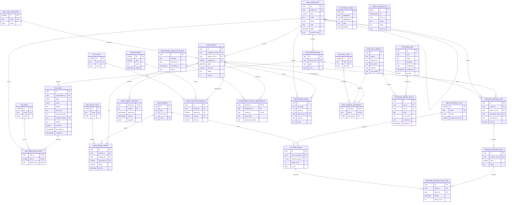

# ER-диаграмма базы данных

На схеме показаны основные таблицы и их связи. Описание каждой таблицы, полей и ограничений находится в [`db/schema.md`](../../db/schema.md).

```mermaid
erDiagram
  ORG_ADMIN_UNIT {
    uuid id PK
    uuid parent_id FK
    smallint level
    text code
    jsonb name
    ltree path
    geometry geom
    char country_code
  }
  ORG_ORGANIZATION {
    uuid id PK
    uuid admin_unit_id FK
    text type
    jsonb name
  }
  IAM_USER {
    uuid id PK
    uuid organization_id FK
    citext login UK
    citext email
    text phone
    text full_name
    text password_hash
    text external_subject UK
    text locale
    boolean is_active
    timestamptz last_login_at
    timestamptz created_at
  }
  IAM_ROLE {
    smallint id PK
    text code UK
    jsonb name
  }
  IAM_USER_ROLE_SCOPE {
    uuid user_id PK, FK
    smallint role_id PK, FK
    uuid admin_unit_id PK, FK
  }
  REF_LAND_CATEGORY {
    smallint id PK
    text code UK
    jsonb name
  }
  REF_RIGHT_TYPE {
    smallint id PK
    text code UK
    jsonb name
  }
  REF_CROP {
    smallint id PK
    text code UK
    jsonb name
  }
  REF_LIVESTOCK_TYPE {
    smallint id PK
    text code UK
    jsonb name
    numeric sheep_unit_factor
  }
  REF_DOC_TYPE {
    smallint id PK
    text code UK
    jsonb name
  }
  LAND_SUBJECT {
    uuid id PK
    text type
    text full_name
    text tax_id UK
  }
  LAND_PARCEL {
    uuid id PK
    text cadastral_number UK
    uuid admin_unit_id FK
    smallint category_id FK
    geometry geom
    numeric area_ha
    text status
    int version
  }
  LAND_PARCEL_VERSION {
    uuid parcel_id PK, FK
    int version PK
    timestamptz valid_from
    timestamptz valid_to
    jsonb snapshot
  }
  LAND_PARCEL_RIGHT {
    uuid id PK
    uuid parcel_id FK
    uuid subject_id FK
    smallint right_type_id FK
    numeric share
    daterange period
  }
  PASTURE_PASTURE_UNIT {
    uuid id PK
    uuid parcel_id FK
    uuid admin_unit_id FK
    uuid committee_org_id FK
    text use_season
    numeric area_ha
  }
  PASTURE_HERD {
    uuid id PK
    uuid owner_subject_id FK
    smallint livestock_type_id FK
    int head_count
    date as_of
  }
  PASTURE_PASTURE_PLAN {
    uuid id PK
    uuid pasture_unit_id FK
    smallint year
    text status
  }
  PASTURE_PASTURE_PLAN_ITEM {
    uuid id PK
    uuid plan_id FK
    uuid herd_id FK
    daterange period
    int head_count
  }
  CROP_SEASON {
    smallint id PK
    smallint year
    text code
    daterange period
  }
  CROP_CROP_DECLARATION {
    uuid id PK
    uuid parcel_id FK
    smallint season_id FK
    smallint crop_id FK
    numeric area_ha
  }
  MONITORING_SATELLITE_SCENE {
    uuid id PK
    text provider
    text external_id
    timestamptz acquired_at
    text status
  }
  MONITORING_PARCEL_OBSERVATION {
    uuid parcel_id PK, FK
    date observed_on PK
    uuid scene_id PK, FK
    real ndvi_mean
    real valid_pixel_share
  }
  MONITORING_ALERT {
    uuid id PK
    text rule_code
    uuid parcel_id FK
    uuid admin_unit_id FK
    text severity
    text status
  }
  DOCS_FILE_OBJECT {
    uuid id PK
    text bucket
    text object_key
    text file_name
    char sha256
    text scan_status
  }
  DOCS_PARCEL_DOCUMENT {
    uuid parcel_id PK, FK
    uuid file_id PK, FK
    smallint doc_type_id FK
  }
  PLATFORM_JOB {
    uuid id PK
    text type
    text status
    int attempts
    uuid created_by
    timestamptz created_at
    jsonb params
  }
  PLATFORM_IMPORT_BATCH {
    uuid id PK
    uuid job_id FK
    uuid file_id FK
    text kind
    int error_rows
    uuid created_by
    timestamptz created_at
  }
  PLATFORM_OUTBOX {
    bigint id PK
    text aggregate
    uuid aggregate_id
    text type
    jsonb payload
  }
  AUDIT_CHANGE_LOG {
    bigint id PK
    timestamptz at
    uuid actor_id
    text action
    text entity
    uuid entity_id
  }

  ORG_ADMIN_UNIT ||--o{ ORG_ADMIN_UNIT : parent
  ORG_ADMIN_UNIT ||--o{ ORG_ORGANIZATION : contains
  ORG_ORGANIZATION o|--o{ IAM_USER : employs
  IAM_USER ||--o{ IAM_USER_ROLE_SCOPE : assigned
  IAM_ROLE ||--o{ IAM_USER_ROLE_SCOPE : grants
  ORG_ADMIN_UNIT ||--o{ IAM_USER_ROLE_SCOPE : scopes
  ORG_ADMIN_UNIT ||--o{ LAND_PARCEL : locates
  REF_LAND_CATEGORY ||--o{ LAND_PARCEL : classifies
  LAND_PARCEL ||--o{ LAND_PARCEL_VERSION : versions
  LAND_PARCEL ||--o{ LAND_PARCEL_RIGHT : has
  LAND_SUBJECT ||--o{ LAND_PARCEL_RIGHT : holds
  REF_RIGHT_TYPE ||--o{ LAND_PARCEL_RIGHT : defines
  LAND_PARCEL o|--o{ PASTURE_PASTURE_UNIT : contains
  ORG_ADMIN_UNIT ||--o{ PASTURE_PASTURE_UNIT : locates
  ORG_ORGANIZATION o|--o{ PASTURE_PASTURE_UNIT : manages
  LAND_SUBJECT ||--o{ PASTURE_HERD : owns
  REF_LIVESTOCK_TYPE ||--o{ PASTURE_HERD : classifies
  PASTURE_PASTURE_UNIT ||--o{ PASTURE_PASTURE_PLAN : planned
  PASTURE_PASTURE_PLAN ||--o{ PASTURE_PASTURE_PLAN_ITEM : contains
  PASTURE_HERD ||--o{ PASTURE_PASTURE_PLAN_ITEM : scheduled
  LAND_PARCEL ||--o{ CROP_CROP_DECLARATION : declared_for
  CROP_SEASON ||--o{ CROP_CROP_DECLARATION : during
  REF_CROP ||--o{ CROP_CROP_DECLARATION : grows
  LAND_PARCEL ||--o{ MONITORING_PARCEL_OBSERVATION : observed
  MONITORING_SATELLITE_SCENE ||--o{ MONITORING_PARCEL_OBSERVATION : produces
  LAND_PARCEL ||--o{ MONITORING_ALERT : raises
  ORG_ADMIN_UNIT ||--o{ MONITORING_ALERT : scopes
  LAND_PARCEL ||--o{ DOCS_PARCEL_DOCUMENT : documented_by
  DOCS_FILE_OBJECT ||--o{ DOCS_PARCEL_DOCUMENT : attaches
  REF_DOC_TYPE ||--o{ DOCS_PARCEL_DOCUMENT : classifies
  PLATFORM_JOB o|--o{ PLATFORM_IMPORT_BATCH : processes
  DOCS_FILE_OBJECT o|--o{ PLATFORM_IMPORT_BATCH : imports
```
